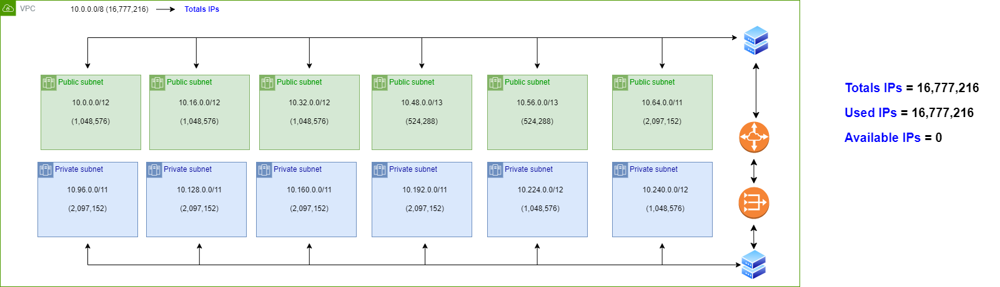
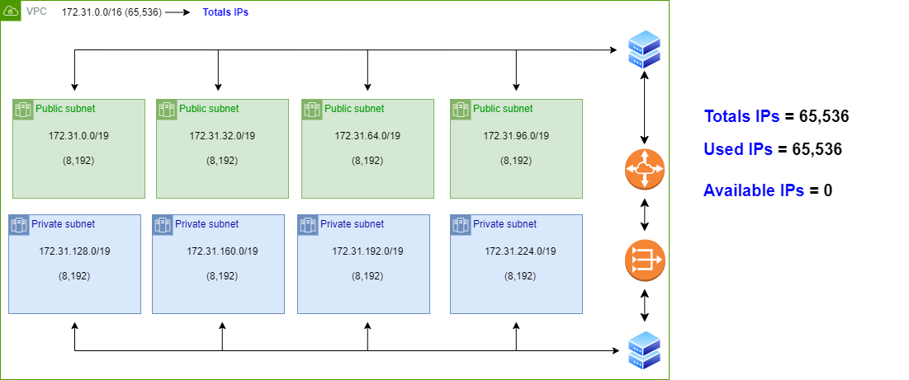
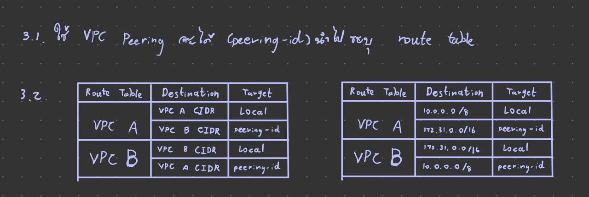
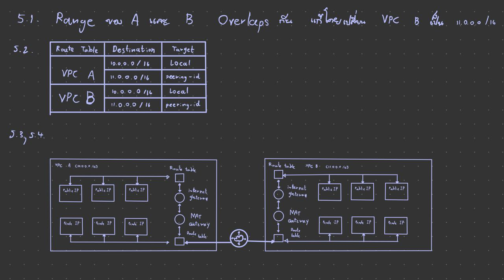
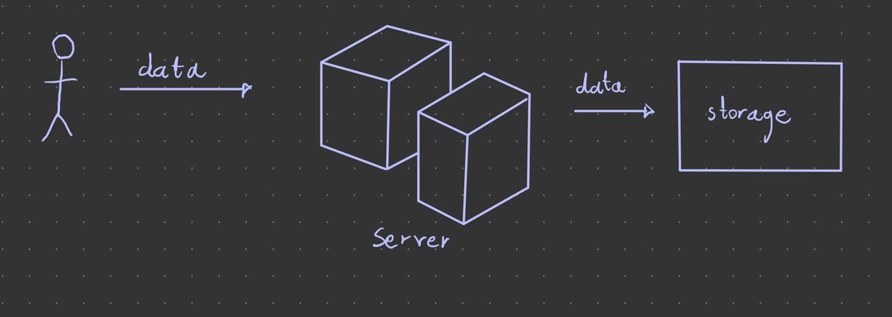

# **LAB 06**

### **จิรภัทร ศรีสมพันธุ์ เลขที่10 6303051613106**

#### 1.กำหนดให้ VPC มี CIDR range 10.0.0.0/8 จงออกแบบ subnet(vswitch) ตามรายละเอียดดังนี้

>  ##### 1.1)public 6 zone พร้อมระบุจำนวน ip ที่ใช้ได้

>  ##### 1.2)private: 6 zone พร้อมระบุจำนวน ip ที่ใช้ได้

>  ##### 1.3)ระบุจำนวน ip ที่ยังเหลือ

>  ##### เงื่อนไข: ให้เหลือจำนวน Available IPs น้อยที่สุด

#### 2.กำหนดให้ VPC มี CIDR range 172.31. 0.0/16 จงออกแบบ subnet(vswitch) ตามรายละเอียดดังนี้  

>  ##### 2.1)public 4 zone พร้อมระบุจำนวน ip ที่ใช้ได้

>  ##### 2.2)private: 4 zone พร้อมระบุจำนวน ip ที่ใช้ได้

>  ##### 2.3)ระบุจำนวน ip ที่ยังเหลือ

>  ##### เงื่อนไข: ให้เหลือจำนวน Available IPs น้อยที่สุด

#### 3.จากคำตอบข้อ 1 และ 2 ให้ตอบคำถามย่อยต่อไปนี้

>  ##### 3.1)ต้องใช้ Service อะไรที่ทำให้ VPC จากข้อที่ 1 และ 2 สามารถรับส่งข้อมูลถึงกันได้

>  ##### 3.2)จงวาดตาราง Route Table พร้อมระบุการ ค่าให้เรียบร้อย

#### 4.(optional)~~ให้ออกแบบระบบซื้อขายของออนไลน์โดยมีองค์ประกอบดังนี้~~

>  ##### ~~4.1) สินค้า (product), ตะกร้าสินค้า(cart), จ่ายเงิน(payment), การขนส่งสิ่นค้า(Shipping), ผู้ใช้ (user)~~

>  ##### ~~4.2) Database Service~~

>  ##### ~~4.3) สามารถรองรับผู้ใช้งานได้จำนวนมหาศาล (แบบง่าย)~~

#### 5.กำหนดให้ VPC A มี CIDR (10.0.0.0/16) และ VPC B มี CIDR (10.0.0.0/20)จงตอบคำถามต่อไปนี้

>  ##### 5.1)VPC A และ VPC B สามารถ peering กันได้หรือไม่ หากไม่ได้จงบอกเหตุผล

>  ##### 5.2)กรณีถ้า Peering ได้ จะต้องทำอย่างไร ให้ service ที่อยู่ภายใน VPC ทั้งสองสามารถติดต่อสื่อสารกันได้

>  ##### 5.3)ให้วาดรูป architecture ประกอบ

>  ##### 5.4)(Optional) ใส่ component อื่นๆ ให้ครบ เช่น LB, Compute Engine, NatGW

#### 6.)Hypervisor มีกี่ประเภทแต่ละประเภทคืออะไรบ้าง แล้วประเภทไหนที่ Computer ของเราใช้งานในการเปิด emulator (อยากให้ตอบตามความเข้าใจ ห้าม copy มาตอบ)

 - Hypervisor Type 1 ทำงานบนฮาร์ดแวร์โดยตรงไม่ต้องแชร์ทรัพยากรร่วมกับ Host OS 
 - Hypervisor Type 2 ทำงานคล้ายซอฟต์แวร์อย่างนึงจึงต้องทำงานบน Host OS และใช้ทรัพยากรร่วมกัน
 

     Type 2

#### 7.(optional) ~~ให้ออกแบบ architecture ที่นำ application ของเรามาเชื่อมต่อกับ Cloud (ไม่มีผิดไม่มีถูกอยากให้ลองออกแบบกันมาว่าถ้า application ของเราขึ้นไปอยู่บน cloud จะมีหน้าตาแบบไหน)~~

#### 8.ให้ตอบคำถามต่อไปนี้เกี่ยวกับ Debian

>  ##### 8.1)Debian คืออะไร

>  ##### 8.2)version stable ล่าสุดมีชื่อเล่นว่าอะไร

>  ##### 8.3)Package Manager ต้องใช้คำสั่งอะไร

>  ##### 8.4)หากต้องการติดตั้ง git ควรใช้คำสั่งอะไร

 - Linux distribution ที่พัฒนาจาก community ไม่มีใครอยู่เบื้องหลัง
 - bullseye , 11.6
 - apt
 - apt install git
 
#### 9.ให้ตอบคำถามต่อไปนี้เกี่ยวกับ Alpine

>  ##### 9.1)Alpine คืออะไร

>  ##### 9.2)version stable ล่าสุดมีคือ version อะไร

>  ##### 9.3)Package Manager ต้องใช้คำสั่งอะไร

>  ##### 9.4)หากต้องการติดตั้ง git ควรใช้คำสั่งอะไร

 - Linux ที่ใช้ contrainer ไม่เกิน 8 Mb และใช้พื้นที่รวมไม่เกิน 180 Mb และมีความปลอดภัยสูง
 - 3.17
 - apk
 - apk add git

#### 10.ให้ตอบคำถามต่อไปนี้เกี่ยวกับ Amazonlinux

>  ##### 10.1)Amazonlinux คืออะไร

>  ##### 10.2)version stable ล่าสุดมีชื่อเล่นว่าอะไร

>  ##### 10.3)Package Manager ต้องใช้คำสั่งอะไร

>  ##### 10.4)หากต้องการติดตั้ง git ควรใช้คำสั่งอะไร

 - Linux ของ Amazon web services ดำเนินการได้เสถียร ปลอด ประสิทธิภาพสูง สำหรับ Application ที่ทำงานบน Amazon EC 2
 - 2.0.20230207.0
 - yum
 - yum install git

#### 11.หากเราต้องการสร้างบริษัทเป็นผู้ให้บริการ Cloud จงตอบคำถามต่อไปนี้

>  ##### 11.1)เราควรมีอุปกรณ์ Hardware อะไรบ้าง พร้อมอธิบาย

>  ##### 11.2)เราควรมี Software อะไรบ้าง พร้อมอธิบาย

>  ##### 11.3)วาดภาพ Architecture ของ Cloud Service ของเรา

>  ##### 11.4)ชื่อ Cloud ที่เราให้บริการมีชื่อว่าอะไร

>  ##### 11.5)Cloud ของเรามี service อะไร ที่ให้บริการผู้ใช้งานได้บ้าง

 - คอมเซิฟเวอร์ : เก็บข้อมูลและประมวลผลข้อมูล ให้บริการ user 
 อุปกรณ์เครื่อข่าย : เชื่อมเซิฟเวอร์เข้าแหล่งเก็บข้อมูล
 แหล่งเก็บข้อมูลขนาดใหญ่ : ให้ user เก็บข้อมูล
 
 - Firewall ป้องกันการเข้าถึงข้อมูลโดยไม่ได้รับอนุญาต
 Load balance ควบคุมสมดุลการรับส่งข้อมูลของเซิฟเวอร์
 Recovery , back up ป้องกันข้อมูลสูญหาย และการกู้คืน
 
 - 
 - okeno cloud
 - บริการเชื่อมต่อกับ ChatGPT และ เว็บแปลภาษา เพื่อให้ใช้งาน ChatGPT เป็นภาษาไทยได้

